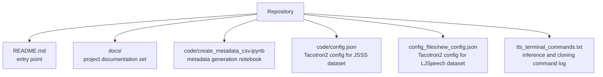

# coqui_ai_tts

This repository is an archive of a small Coqui TTS experimentation workflow. It is not a packaged application or reusable library. Instead, it captures the artifacts used to:

- prepare dataset metadata for training,
- store Tacotron2 training configurations for two different datasets,
- keep a command log for inference and voice-cloning experiments.

The project is centered around Coqui TTS rather than custom Python modules in this repository. Most of the actual heavy lifting happens inside the external `tts` CLI and the upstream Coqui training codebase.

## What Is In This Repository

## Documentation Map

- [Repository Overview](docs/repository-overview.md)
- [Workflow Guide](docs/workflows.md)
- [Configuration Reference](docs/configuration-reference.md)

## Repository Characteristics

- This is an archive-style project with very little automation.
- Several paths are hard-coded to the original author environment, including Google Drive and local Linux paths.
- The notebook is a one-purpose preprocessing step for building a metadata file from transcripts.
- The config files target Coqui TTS Tacotron2 training runs.
- The terminal command file acts as a manual runbook for TTS generation and voice cloning.

## Quick Orientation

1. Start with [docs/repository-overview.md](docs/repository-overview.md) to understand each artifact.
2. Read [docs/workflows.md](docs/workflows.md) for the end-to-end process.
3. Use [docs/configuration-reference.md](docs/configuration-reference.md) when modifying training settings or porting configs to a new machine.

## Source Files

- [README.md](README.md)
- [code/create_metadata_csv.ipynb](code/create_metadata_csv.ipynb)
- [code/config.json](code/config.json)
- [config_files/new_config.json](config_files/new_config.json)
- [tts_terminal_commands.txt](tts_terminal_commands.txt)
