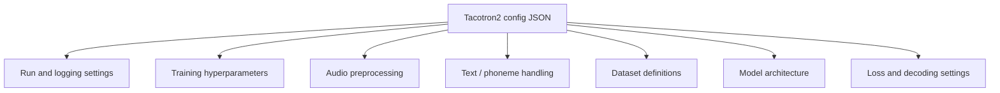
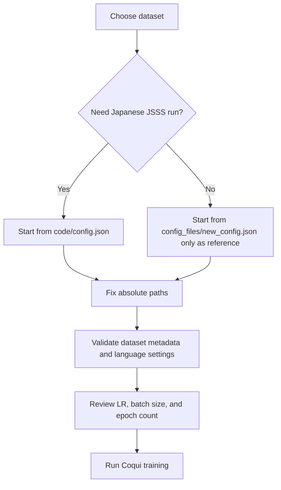

# Configuration Reference

## Scope

This document explains the two Tacotron2 configuration files in the repository:

- [code/config.json](../code/config.json)
- [config_files/new_config.json](../config_files/new_config.json)

Both files are broadly similar in schema because they target the same model family, but they encode different experimental intent.

## Configuration Anatomy

## Shared Characteristics

Both configs share these core decisions:

- model: `tacotron2`
- dashboard logger: `tensorboard`
- optimizer: `RAdam`
- scheduler: `NoamLR`
- sample rate: `22050`
- mel bins: `80`
- phoneme-based text processing: enabled
- single-speaker setup: `num_speakers = 1`
- dynamic convolution attention with location attention enabled

These common settings suggest the repository was experimenting with dataset portability while keeping the model family stable.

## Side-By-Side Comparison

| Area | `code/config.json` | `config_files/new_config.json` | Interpretation |
| --- | --- | --- | --- |
| Dataset | `jsss_ver1_shortform_basic5000` | `ljspeech` | Different training corpora |
| Language | `ja` | empty string | Japanese dataset vs likely English default |
| Output path | Local Linux path | Google Drive path | Different execution environments |
| Epochs | `1000` | `3` | Long training run vs short experiment |
| Batch size | `64` | `8` | Larger GPU budget vs smaller run |
| Eval batch size | `16` | `8` | Scaled down with training batch size |
| Learning rate | `0.0001` | `0.3` | Conservative training vs aggressive test config |
| LR warmup params | explicit `warmup_steps` | absent | More tuned training recipe in `code/config.json` |
| Save behavior | `save_all_best = false` | `save_all_best = true` | Different checkpoint retention strategy |
| Save best after | `10000` | `10` | Long-run training vs very early save threshold |
| Test sentences file | empty | explicit path | LJSpeech config externalizes test prompt file |

## Important Sections

### 1. Run And Logging Settings

These fields control where outputs go and how the run is tracked:

- `output_path`
- `run_name`
- `dashboard_logger`
- `save_step`
- `save_checkpoints`
- `save_n_checkpoints`
- `save_all_best`

The most important portability issue here is `output_path`. In both files it is absolute and tied to the original machine layout.

### 2. Training Hyperparameters

Key fields:

- `epochs`
- `batch_size`
- `eval_batch_size`
- `lr`
- `optimizer`
- `optimizer_params`
- `lr_scheduler`
- `lr_scheduler_params`
- `grad_clip`

The two files diverge most strongly in this section. `code/config.json` looks internally coherent for a serious training run. `config_files/new_config.json` looks more like a quick-start or temporary experiment and should be reviewed carefully before reuse.

### 3. Audio Settings

Both files use effectively the same audio preprocessing:

- FFT size `1024`
- window length `1024`
- hop length `256`
- sample rate `22050`
- mel range `0` to `8000`
- silence trimming enabled

This consistency means the project did not vary front-end audio processing much across experiments.

### 4. Text And Phoneme Processing

Key fields:

- `use_phonemes`
- `phoneme_language`
- `text_cleaner`
- `characters`
- `add_blank`

Even though the Japanese config has dataset language `ja`, both configs use `phoneme_language: en-us`. That is a detail worth validating against the exact Coqui version and intended tokenizer behavior before reuse.

### 5. Dataset Definition

Each config includes a `datasets` array describing:

- dataset name,
- root path,
- training metadata file,
- optional validation metadata,
- language code.

This is the bridge between repository artifacts and the actual dataset stored elsewhere on disk.

### 6. Model And Decoder Settings

Representative model fields:

- `r`
- `encoder_in_features`
- `decoder_in_features`
- `attention_type`
- `location_attn`
- `max_decoder_steps`
- `stopnet`
- `ddc_r`

These settings are largely unchanged between the two configs, which reinforces that the major differences are operational rather than architectural.

## Configuration Decision Flow

## Portability Checklist

Before reusing either config:

1. replace every absolute path,
2. confirm the dataset metadata filename and delimiter format,
3. confirm the language and phoneme settings are correct for the dataset,
4. validate the learning rate and scheduler against the installed Coqui version,
5. ensure output directories are writable,
6. review whether checkpoint frequency is practical for the training duration.

## Most Likely Reuse Strategy

The safer reuse path is:

- treat [code/config.json](../code/config.json) as the main reference for a real run,
- treat [config_files/new_config.json](../config_files/new_config.json) as a secondary experimental variant,
- normalize both into a single template with machine-specific values externalized.
