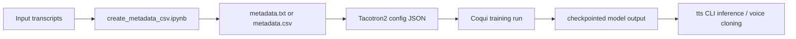

# Repository Overview

## Purpose

This repository documents a lightweight Coqui TTS experimentation setup. It appears to have been used for two related goals:

- training a Tacotron2 text-to-speech model on specific datasets,
- running inference and voice-cloning experiments with the Coqui `tts` command-line interface.

The repository does not contain application code, service code, or a Python package. Its value is in the captured workflow artifacts.

## High-Level Shape



## Files And Roles

### `README.md`

The original repository entry point was minimal. It has now been expanded to act as the documentation index.

### `code/create_metadata_csv.ipynb`

This notebook is the only executable code artifact in the repository. Its purpose is narrow:

- read a transcript file from a hard-coded path,
- split records on `:`,
- assign the columns `wav_filename` and `transcript`,
- write the result as a tab-separated metadata file.

This is a dataset-preparation step for Coqui TTS training. The notebook assumes the input transcript format already matches the expected speaker/file naming convention.

### `code/config.json`

This is a full Tacotron2 training configuration targeting a Japanese dataset:

- dataset name: `jsss_ver1_shortform_basic5000`
- dataset language: `ja`
- model: `tacotron2`
- training horizon: `1000` epochs
- batch size: `64`
- learning rate: `0.0001`

The file is production-oriented relative to the other config in this repository. It looks like the main long-run experiment configuration.

### `config_files/new_config.json`

This is another Tacotron2 configuration, this time targeting LJSpeech:

- dataset name: `ljspeech`
- model: `tacotron2`
- training horizon: `3` epochs
- batch size: `8`
- learning rate: `0.3`

This file reads like a short experiment, smoke test, or early-stage adaptation of a base config rather than a long training recipe.

### `tts_terminal_commands.txt`

This file is a manual command journal rather than source code. It contains:

- a basic single-speaker synthesis example using a pretrained LJSpeech model,
- multiple `your_tts` multilingual cloning runs,
- commands that swap speaker reference audio while keeping English output text,
- examples using `.wav` and `.mp3` speaker references.

The file is useful as an operational record, but it is not parameterized or portable as written.

## Repository Tree

```text
coqui_ai_tts/
├── README.md
├── docs/
│   ├── configuration-reference.md
│   ├── repository-overview.md
│   └── workflows.md
├── code/
│   ├── config.json
│   └── create_metadata_csv.ipynb
├── config_files/
│   └── new_config.json
└── tts_terminal_commands.txt
```

## Architectural Reality

The main architectural point is that the repository depends on external systems for almost everything important:

- the Coqui TTS codebase and CLI,
- local or cloud-mounted datasets,
- a GPU-capable training environment,
- filesystem layouts that match the hard-coded paths in the JSON and notebook.

That means this repository should be understood as a workflow snapshot, not a self-contained product.

## Assumptions Captured In The Files

- The user already has Coqui TTS installed and usable via `tts`.
- Training data exists outside the repository.
- Dataset metadata is generated manually before training.
- Output directories are chosen per experiment and stored as absolute paths.
- Phoneme-based preprocessing is enabled in both configs.
- The project assumes single-speaker Tacotron2 training rather than a multi-speaker architecture.

## Main Risks When Reusing This Repository

- Absolute paths will fail immediately on another machine.
- There is no lockfile, environment spec, or setup guide in the repo.
- The notebook writes directly to a hard-coded target without validation.
- The command log contains hand-written experiments rather than repeatable scripts.
- The configs are large and valid only in the context of a matching Coqui TTS version.

## Best Way To Use This Repository

Treat it as reference material for reconstructing a Coqui TTS workflow:

1. port the file paths,
2. verify dataset metadata format,
3. validate the config against the installed Coqui TTS version,
4. convert ad hoc commands into reusable scripts if ongoing work is needed.
