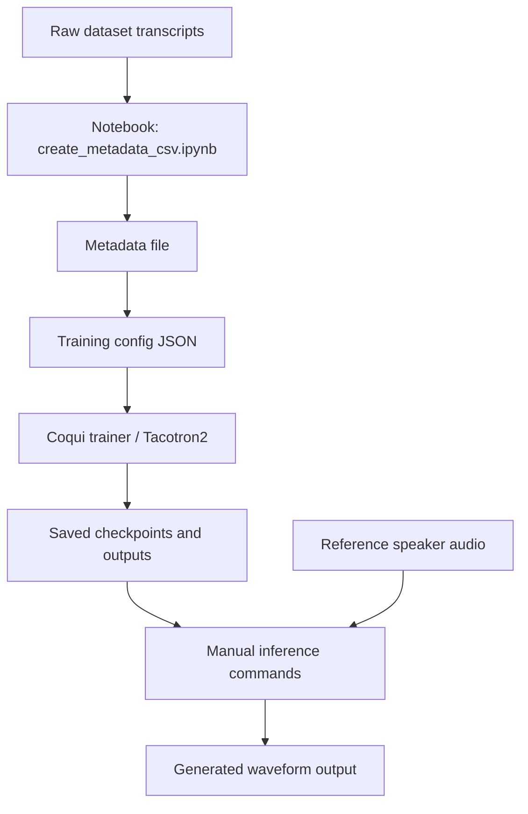
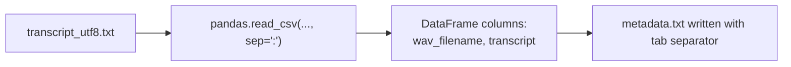
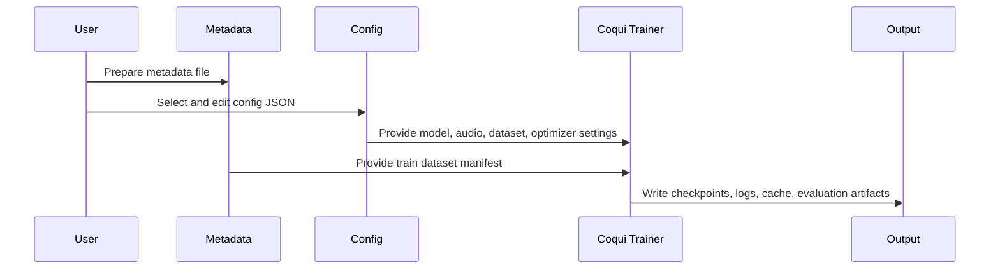
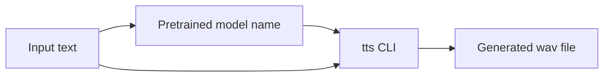
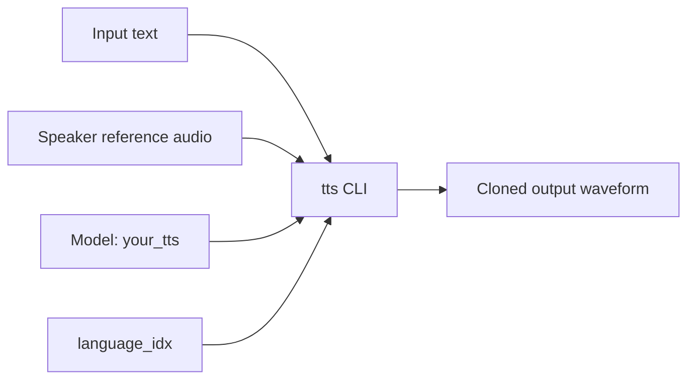

# Workflow Guide

## Overview

The repository captures three distinct workflows:

1. metadata preparation for training,
2. Tacotron2 model training,
3. inference and voice cloning through the `tts` CLI.

## End-To-End Flow

## Workflow 1: Metadata Preparation

The notebook in [code/create_metadata_csv.ipynb](../code/create_metadata_csv.ipynb) is a very small preprocessing utility.

### What It Does

- imports `pandas`,
- reads a transcript file from an absolute path,
- parses each line using `:` as the separator,
- assigns the output columns `wav_filename` and `transcript`,
- writes a tab-separated metadata file.

### Intended Input And Output

### Interpretation

This notebook is designed to reshape transcript data into a format Coqui training can consume. It is narrowly scoped and assumes:

- the transcript source file already exists,
- `:` is a safe delimiter,
- the left side maps to the audio file identifier,
- the right side contains the full transcript text.

### Operational Limitation

If any transcript line contains an unexpected colon, the simple separator-based parsing could split incorrectly. There is no validation logic in the notebook to catch malformed rows.

## Workflow 2: Model Training

The actual training logic is not implemented in this repository. Instead, the repository stores full configuration payloads used by an external Coqui TTS trainer.

### Training Control Flow

### Training Inputs

- dataset path
- training metadata file
- output path
- phoneme and character settings
- optimizer and scheduler settings
- audio preprocessing parameters
- Tacotron2 architecture choices

### Training Outputs

Expected outputs are not stored in the repository, but the config indicates the training run would produce:

- checkpoints,
- best-model saves,
- evaluation logs,
- tensorboard logs,
- phoneme cache artifacts.

## Workflow 3: Inference And Voice Cloning

The file [tts_terminal_commands.txt](../tts_terminal_commands.txt) records manual commands used with the `tts` CLI.

### Two Inference Modes Appear In The File

#### Standard TTS

This mode uses a pretrained model and plain text as input.

#### Voice Cloning With `your_tts`

This mode adds a reference speaker audio file and language selection.

### Repeated Pattern In The Command Log

The commands consistently follow this structure:

- choose a model,
- provide output path,
- provide source text,
- optionally provide speaker reference audio,
- optionally provide language index.

### What The Command Log Suggests

- The repository owner was exploring style transfer and voice cloning.
- The same speaker reference was reused across different target texts.
- The focus was experimentation rather than automation.
- The commands were edited manually over time rather than wrapped in scripts.

## Practical Reuse Guidance

If you want to operationalize these workflows, the clean sequence is:

1. replace all absolute paths with environment-specific variables or relative paths,
2. convert the notebook into a script with validation,
3. template the config files,
4. turn the command log into shell scripts or a Makefile,
5. document the exact Coqui TTS version used for reproducibility.
